Deploying a secure ASP.NET MVC site with Membership, OAuth, and a SQL Database to an Azure Website 
========================================

This lab shows you how to build a secure **ASP.NET MVC 5** web app that enables users to log in with credentials from _Facebook_ or _Google_. You will also deploy the application to Azure.
On completing this lab, you'll have a secure data-driven web application up and running in the cloud and using a cloud database.

You will learn:

- How to create a secure ASP.NET MVC 5 project and publish it to an Azure Website. 
- How to use [OAuth](http://oauth.net/) and the ASP.NET membership database to secure your application. 
- How to use a SQL database to store data in Azure.

You'll build a simple contact list web app that is built on ASP.NET MVC 5 and uses the ADO.NET Entity Framework for database access. The following illustration shows the login page for the completed application:


_The ASP.NET MVC 5 application_

This lab includes the following exercises:

1. [Create an ASP.NET MVC 5 application](#Exercise1)
2. [Enabling SSL for the Project](#Exercise2)
3. [Deploying the application to Azure](#Exercise3)
4. [Adding a database to the application](#Exercise4)
5. [Add a Controller and a view for the data](#Exercise5)
6. [Enabling Migrations, create the database, add sample data and a data initializer](#Exercise6)
7. [Adding an OAuth2 Provider](#Exercise7)
8. [Using the Membership API](#Exercise8)
9. [Using Temporary Code to Add New Social Login Users to the canEdit Role](#Exercise9)
10. [Protecting the Application with SSL and the Authorize Attribute](#Exercise10)
11. [Deploying the app to Azure](#Exercise11)
12. [Examining the SQL Azure DB](#Exercise12)
13. [Setting up Azure firewall rules](#Exercise13)
14. [To Add a User to the canEdit Role by editing database tables](#Exercise14)

<a name="Exercise1" />
##Create an ASP.NET MVC 5 application

**[CREATION STEPS OMITTED]**

Continue working with the solution created in the previous lab.

1. In **Solution Explorer** open the _Layout.cshtml_ file in the _Views\Shared_ folder.

	
	
	_Editting the **layout.cshtml** file_

2. Replace the markup in the _Layout.cshtml_ file with the following code. The changes are highlighted below.

	<!-- mark:6,19,35 -->
	````HTML
	<!DOCTYPE html>
	<html>
	<head>
		<meta charset="utf-8" />
		<meta name="viewport" content="width=device-width, initial-scale=1.0">
		<title>@ViewBag.Title - Contact Manager</title>
		@Styles.Render("~/Content/css")
		@Scripts.Render("~/bundles/modernizr")
	</head>
	<body>
		<div class="navbar navbar-inverse navbar-fixed-top">
			<div class="container">
				<div class="navbar-header">
					<button type="button" class="navbar-toggle" data-toggle="collapse" data-target=".navbar-collapse">
						<span class="icon-bar"></span>
						<span class="icon-bar"></span>
						<span class="icon-bar"></span>
					</button>
					@Html.ActionLink("CM Demo", "Index", "Cm", new { area = "" }, new { @class = "navbar-brand" })
				</div>
				<div class="navbar-collapse collapse">
					<ul class="nav navbar-nav">
						<li>@Html.ActionLink("Home", "Index", "Home")</li>
						<li>@Html.ActionLink("About", "About", "Home")</li>
						<li>@Html.ActionLink("Contact", "Contact", "Home")</li>
					</ul>
					@Html.Partial("_LoginPartial")
				</div>
			</div>
		</div>
		<div class="container body-content">
			@RenderBody()
			<hr />
			<footer>
				<p>&copy; @DateTime.Now.Year - Contact Manager</p>
			</footer>
		</div>
		@Scripts.Render("~/bundles/jquery")
		@Scripts.Render("~/bundles/bootstrap")
		@RenderSection("scripts", required: false)
	</body>
	</html>
	````

3. Press **CTRL+F5** to run the app. The application home page appears in the default browser.
 
	

	_Running the app locally_

	This is all you need to do for now to create the application that you'll deploy to Azure. 

<a name="Exercise2" />
##Enabling SSL for the Project
In this task we will go trough the process of creating a new element for our subscription. In particular, we will create a new website using the **Create Wizard**.

1. Enable SSL. In Solution Explorer, click the **ContactManager** project, then press **F4** to bring up the properties dialog. Change **SSL Enabled** to true. Copy the **SSL URL**. The SSL URL will be _https://localhost:44300/_ unless you've previously created SSL Websites.

	
	
	_Enabling SSL_

2. In Solution Explorer, right click the **Contact Manager** project and click **Properties**.

3. In the left tab, click **Web**.

4. Change the **Project Url** to use the **SSL URL** and save the page (**Control+S**).

	

	_Changing the project URL_

5. Verify **Internet Explorer** is the browser Visual Studio launches as shown in the image below:

	

	_Browser selector_
	
	> **Note:** You can select multiple browsers and have Visual Studio update each browser when you make changes. For more information see [Using Browser Link in Visual Studio 2013](http://www.asp.net/visual-studio/overview/2013/using-browser-link).
	
6. Press **CTRL+F5** to run the application. Follow the instructions to trust the self-signed certificate that IIS Express has generated.
 
	
	
	_Trusting the self-signed certificate_

7. Read the **Security Warning** dialog and then click **Yes** if you want to install the certificate representing **localhost**.

	

	_Installing SSL Certificate warning_
 
8. IE shows the _Home_ page and there are no SSL warnings.
 
	
	
	_Application running without security warnings_

	Google Chrome also accepts the certificate and will show HTTPS content without a warning. Firefox uses its own certificate store, so it will display a warning.
 
	
	
	_Firefox SSL security warning_
	
<a name="Exercise3" />
##Deploying the application to Azure

1. In Visual Studio, right-click the project in **Solution Explorer** and select **Publish** from the context menu.
 
	
	
	_Publish in project context menu_
	
	The **Publish Web** wizard opens.
	
2. In the **Publish Web** dialog box, click **Publish**.

	
	
	_Publishing the application_

	The application you created is now running in the cloud. The next time you deploy the application, only the changed (or new) files will be deployed.
 
	
	
	_The application running in the cloud_

<a name="Exercise4" />
##Adding a database to the application

Next, you will update the app to add the ability to display and update contacts and store the data in a database. The app will use the Entity Framework (EF) to create the database and to read and update data.

### Add data model classes for the contacts

You begin by creating a simple data model in code.

1. In **Solution Explorer**, right-click the Models folder, click **Add**, and then **Class**.

	
	
	_Add Class in Models folder context menu_

2. In the **Add New Item** dialog box, name the new class file *Contact.cs*, and then click **Add**.

	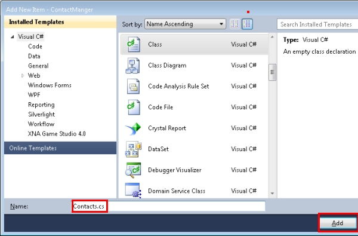
	
	_Adding a new data model class_

3. Replace the contents of the Contacts.cs file with the following code.

	````C#
	using System.ComponentModel.DataAnnotations;
	using System.Globalization;
	namespace ContactManager.Models
	{
	    public class Contact
	    {
		public int ContactId { get; set; }
		public string Name { get; set; }
		public string Address { get; set; }
		public string City { get; set; }
		public string State { get; set; }
		public string Zip { get; set; }
		[DataType(DataType.EmailAddress)]
		public string Email { get; set; }
	    }
	}
	````
	
The **Contacts** class defines the data that you will store for each contact, plus a primary key, *ContactID*, that is needed by the database.

<a name="Exercise5" />
##Add a Controller and a view for the data

**Create web pages that enable app users to work with the contacts**. The ASP.NET MVC scaffolding feature can automatically generate code that performs create, read, update, and delete (CRUD) actions.

1. Build the project **(Ctrl+Shift+B)**. (You must build the project before using the scaffolding mechanism.) 
2. In **Solution Explorer**, right-click the Controllers folder and click **Add**, and then click **Controller**.

	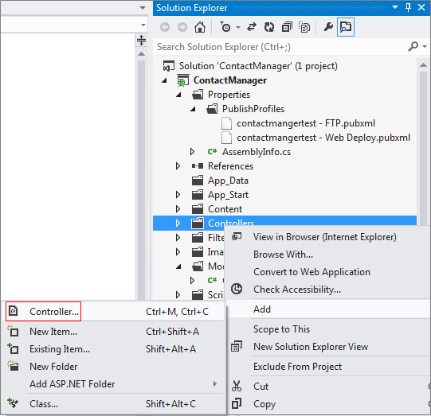
	
	_Adding a controller in the Controllers folder_

3. In the **Add Scaffold** dialog box, select **MVC 5 Controller with views, using EF** and then click **Add**.
	
	

	_Adding a controller using scaffolding_

4. In the **Model class** dropdown box, select **Contact (ContactManager.Models)**. (See the image below.)
5. In the **Data context class**, select **ApplicationDbContext (ContactManager.Models)**. The **ApplicationDbContext** will be used for both the membership DB and our contact data.
6. In the **Controller name** text entry box, enter "CmController" for the controller name. 

	
	
	_Add Controller dialog_

7. Click **Add**.

   Visual Studio creates a controller methods and views for CRUD database operations for **Contact** objects.

<a name="Exercise6" />
##Enabling Migrations, create the database, add sample data and a data initializer

The next task is to enable the [Code First Migrations](http://msdn.microsoft.com/library/hh770484.aspx) feature in order to create the database based on the data model you created.

1. In the **Tools** menu, select **NuGet Package Manager** and then **Package Manager Console**.

	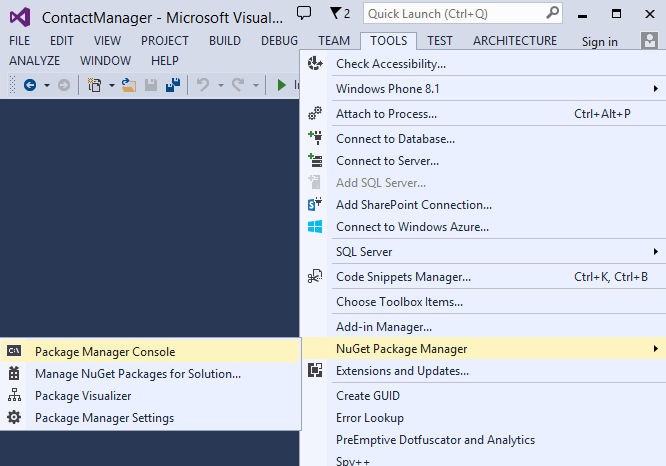
	
	_Opening the Package Manager Console_

2. In the **Package Manager Console** window, enter the following command:

		enable-migrations

	The **enable-migrations** command creates a *Migrations* folder, and it puts in that folder a *Configuration.cs* file that you can edit to seed the database and configure Migrations. 

2. In the **Package Manager Console** window, enter the following command:

		add-migration Initial


	The **add-migration Initial** command generates a file named **&lt;date_stamp&gt;Initial** in the *Migrations* folder that creates the database. The first parameter ( **Initial** ) is arbitrary and is used to create the name of the file. You can see the new class files in **Solution Explorer**.
	In the **Initial** class, the **Up** method creates the Contacts table, and the **Down** method (used when you want to return to the previous state) drops it.
3. Open the *Migrations\Configuration.cs* file. 
4. Add the following namespace. 

	````C#
	using ContactManager.Models;
	````

5. Replace the *Seed* method with the following code:

	````C#
	protected override void Seed(ContactManager.Models.ApplicationDbContext context)
	{
	    context.Contacts.AddOrUpdate(p => p.Name,
	       new Contact
	       {
		   Name = "Debra Garcia",
		   Address = "1234 Main St",
		   City = "Redmond",
		   State = "WA",
		   Zip = "10999",
		   Email = "debra@example.com",
	       },
		new Contact
		{
		    Name = "Thorsten Weinrich",
		    Address = "5678 1st Ave W",
		    City = "Redmond",
		    State = "WA",
		    Zip = "10999",
		    Email = "thorsten@example.com",
		},
		new Contact
		{
		    Name = "Yuhong Li",
		    Address = "9012 State st",
		    City = "Redmond",
		    State = "WA",
		    Zip = "10999",
		    Email = "yuhong@example.com",
		},
		new Contact
		{
		    Name = "Jon Orton",
		    Address = "3456 Maple St",
		    City = "Redmond",
		    State = "WA",
		    Zip = "10999",
		    Email = "jon@example.com",
		},
		new Contact
		{
		    Name = "Diliana Alexieva-Bosseva",
		    Address = "7890 2nd Ave E",
		    City = "Redmond",
		    State = "WA",
		    Zip = "10999",
		    Email = "diliana@example.com",
		}
		);
	}
	````


	This code initializes (seeds) the database with the contact information. For more information on seeding the database, see [Seeding and Debugging Entity Framework (EF) DBs](http://blogs.msdn.com/b/rickandy/archive/2013/02/12/seeding-and-debugging-entity-framework-ef-dbs.aspx).


6. In the **Package Manager Console** enter the command:

		update-database

	
	
	_Update databese command_

	The **update-database** runs the first migration which creates the database. By default, the database is created as a SQL Server Express LocalDB database. 

7. Press **CTRL+F5** to run the application, and then click the **CM Demo** link; or navigate to http://localhost:(port#)/Cm. 

	The application shows the seed data and provides edit, details and delete links. You can create, edit, delete and view data.

	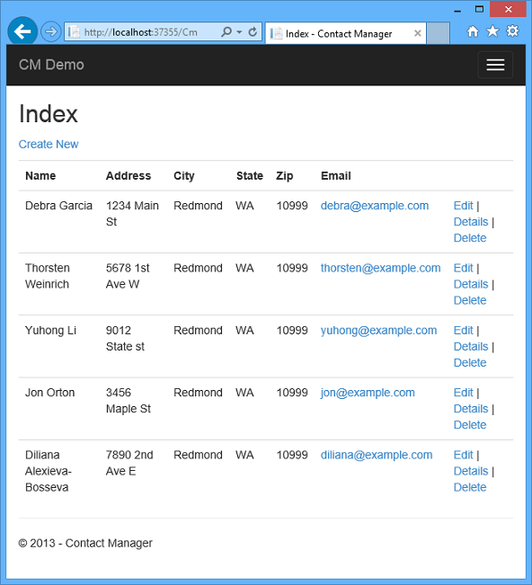
	
	_MVC view of data_

<a name="Exercise7" />
##Adding an OAuth2 Provider

[OAuth](http://oauth.net/ "http://oauth.net/") is an open protocol that allows secure authorization in a simple and standard method from web, mobile, and desktop applications. The ASP.NET MVC internet template uses OAuth to expose Facebook, Twitter, Google and Microsoft as authentication providers. Although this tutorial uses only Google as the authentication provider, you can easily modify the code to use any of these providers. The steps to implement other providers are very similar to the steps you will see in this tutorial. To use Facebook as an authentication provider, see my tutorial [MVC 5 App with Facebook, Twitter, LinkedIn and Google OAuth2 Sign-on ](http://www.asp.net/mvc/tutorials/mvc-5/create-an-aspnet-mvc-5-app-with-facebook-and-google-oauth2-and-openid-sign-on).

In addition to authentication, the tutorial will also use roles to implement authorization. Only those users you add to the *canEdit* role will be able to change data (that is, create, edit, or delete contacts).

Follow the instructions in the following link: [MVC 5 App with Facebook, Twitter, LinkedIn and Google OAuth2 Sign-on ](http://www.asp.net/mvc/tutorials/mvc-5/create-an-aspnet-mvc-5-app-with-facebook-and-google-oauth2-and-openid-sign-on#goog)  under **Creating a Google app for OAuth 2 to set up a Google app for OAuth2**. Run and test the app to verify you can log on using Google authentication.

<a name="Exercise8" />
##Using the Membership API

In this section you will add a local user and the *canEdit* role to the membership database. Only those users in the *canEdit* role will be able to edit data. A best practice is to name roles by the actions they can perform, so *canEdit* is preferred over a role called *admin*. When your application evolves you can add new roles such as *canDeleteMembers* rather than the less descriptive *superAdmin*.

1. Open the *migrations\configuration.cs* file and add the following `using` statements:

 	````C#
	using Microsoft.AspNet.Identity;
	using Microsoft.AspNet.Identity.EntityFramework;
      ````

1. Add the following **AddUserAndRole** method to the class:

    
	````C#
	 bool AddUserAndRole(ContactManager.Models.ApplicationDbContext context)
	 {
	    IdentityResult ir;
	    var rm = new RoleManager<IdentityRole>
		(new RoleStore<IdentityRole>(context));
	    ir = rm.Create(new IdentityRole("canEdit"));
	    var um = new UserManager<ApplicationUser>(
		new UserStore<ApplicationUser>(context));
	    var user = new ApplicationUser()
	    {
	       UserName = "user1@contoso.com",
	    };
	    ir = um.Create(user, "P_assw0rd1");
	    if (ir.Succeeded == false)
	       return ir.Succeeded;
	    ir = um.AddToRole(user.Id, "canEdit");
	    return ir.Succeeded;
	 }
	````


1. Call the new method from the **Seed** method:

	<!-- mark:3 -->
	````C#
	protected override void Seed(ContactManager.Models.ApplicationDbContext context)
	{
	    AddUserAndRole(context);
	    context.Contacts.AddOrUpdate(p => p.Name,
		// Code removed for brevity
	}
	````
	
	The following images shows the changes to *Seed* method:

	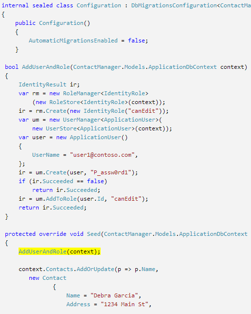
	
	_The updated **Seed** method_

   This code creates a new role called *canEdit*, creates a new local user *user1@contoso.com*, and adds *user1@contoso.com* to the *canEdit* role. For more information, see the [ASP.NET Identity resource page](http://curah.microsoft.com/55636/aspnet-identity).

<a name="Exercise9" />
##Using Temporary Code to Add New Social Login Users to the canEdit Role

In this section you will temporarily modify the **ExternalLoginConfirmation** method in the Account controller to add new users registering with an OAuth provider to the *canEdit* role. We will temporarily modify the **ExternalLoginConfirmation** method to automatically add new users to an administrative role. Until we provide a tool to add and manage roles, we'll use the temporary automatic registration code below. We hope to provide a tool similar to [WSAT](http://msdn.microsoft.com/en-us/library/ms228053.aspx) in the future which allow you to create and edit user accounts and roles. Later in the tutorial I'll show how you can use **Server Explorer** to add users to roles.  

1. Open the **Controllers\AccountController.cs** file and navigate to the **ExternalLoginConfirmation** method.
1. Add the following call to **AddToRoleAsync** just before the **SignInAsync** call.

	````C#
	await UserManager.AddToRoleAsync(user.Id, "canEdit");
	````

   The code above adds the newly registered user to the "canEdit" role, which gives them access to action methods that change (edit) data. An image of the code change is shown below:

   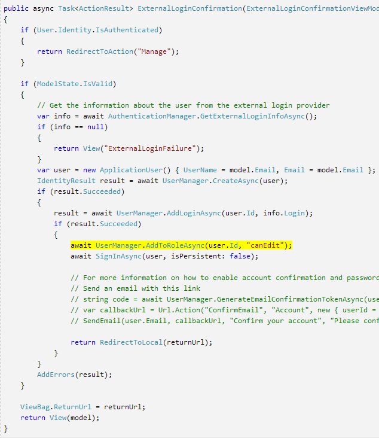
   
   _Adding user to canEdit Role_

Later in the tutorial you will deploy the application to Azure, where you will log-on with Google or another third party authentication provider. This will add your newly registered account to the *canEdit* role. Anyone who finds your site's URL and has a Google ID can then register and update your database. To prevent other people from doing that, you can stop the site. You'll be able to verify who is in the *canEdit* role by examining the database.

In the **Package Manager Console** hit the up arrow key to bring up the following command:

	Update-Database

Run the  **Update-Database** command which will run the **Seed** method, and that will run the **AddUserAndRole** you just added. The **AddUserAndRole** will create the user *user1@contoso.com* and add her to the *canEdit* role.

<a name="Exercise10" />
##Protecting the Application with SSL and the Authorize Attribute
In this section you will apply the [Authorize](http://msdn.microsoft.com/en-us/library/system.web.mvc.authorizeattribute.aspx) attribute to restrict access to the action methods. Anonymous users will be able to view the **Index** action method of the home controller only. Registered users will be able to see contact data (The **Index** and **Details** pages of the Cm controller), the About, and the Contact pages. Only users in the *canEdit* role will be able to access action methods that change data.

1. Add the [Authorize](http://msdn.microsoft.com/en-us/library/system.web.mvc.authorizeattribute.aspx) filter and the [RequireHttps](http://msdn.microsoft.com/en-us/library/system.web.mvc.requirehttpsattribute.aspx) filter to the application. An alternative approach is to add the [Authorize](http://msdn.microsoft.com/en-us/library/system.web.mvc.authorizeattribute.aspx) attribute and the [RequireHttps](http://msdn.microsoft.com/en-us/library/system.web.mvc.requirehttpsattribute.aspx) attribute to each controller, but it's considered a security best practice to apply them to the entire application. By adding them globally, every new controller and action method you add will automatically be protected, you won't need to remember to apply them. For more information see [Securing your ASP.NET MVC  App and the new AllowAnonymous Attribute](http://blogs.msdn.com/b/rickandy/archive/2012/03/23/securing-your-asp-net-mvc-4-app-and-the-new-allowanonymous-attribute.aspx). Open the *App_Start\FilterConfig.cs* file and replace the *RegisterGlobalFilters* method with the following (which adds the two filters):

	<!-- mark:4-5 -->
	````C#
	public static void RegisterGlobalFilters(GlobalFilterCollection filters)
	{
	    filters.Add(new HandleErrorAttribute());
	    filters.Add(new System.Web.Mvc.AuthorizeAttribute());
	    filters.Add(new RequireHttpsAttribute());
	}
	````


	The following image shows the changed code:


	The [Authorize](http://msdn.microsoft.com/en-us/library/system.web.mvc.authorizeattribute.aspx) filter applied in the code above will prevent anonymous users from accessing any methods in the application. You will use the [AllowAnonymous](http://blogs.msdn.com/b/rickandy/archive/2012/03/23/securing-your-asp-net-mvc-4-app-and-the-new-allowanonymous-attribute.aspx) attribute to opt out of the authorization requirement in a couple methods, so anonymous users can log in and can view the home page. The  [RequireHttps](http://msdn.microsoft.com/en-us/library/system.web.mvc.requirehttpsattribute.aspx) will require all access to the web app be through HTTPS.

2. Add the [AllowAnonymous](http://blogs.msdn.com/b/rickandy/archive/2012/03/23/securing-your-asp-net-mvc-4-app-and-the-new-allowanonymous-attribute.aspx) attribute to the **Index** method of the Home controller. The [AllowAnonymous](http://blogs.msdn.com/b/rickandy/archive/2012/03/23/securing-your-asp-net-mvc-4-app-and-the-new-allowanonymous-attribute.aspx) attribute enables you to white-list the methods you want to opt out of authorization. An image of a portion of the HomeController is shown below:	

  	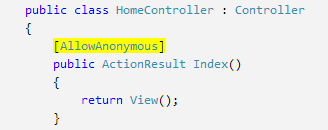
	
	_The AllowAnonymous attribute_

3. Do a global search for *AllowAnonymous*, you can see it is used in the log in and registration methods of the Account controller.

4. In *CmController.cs*, add `[Authorize(Roles = "canEdit")]` to the HttpGet and HttpPost methods that change data (Create, Edit, Delete, every action method except Index and Details) in the *Cm* controller. A portion of the completed code is shown below: 

   	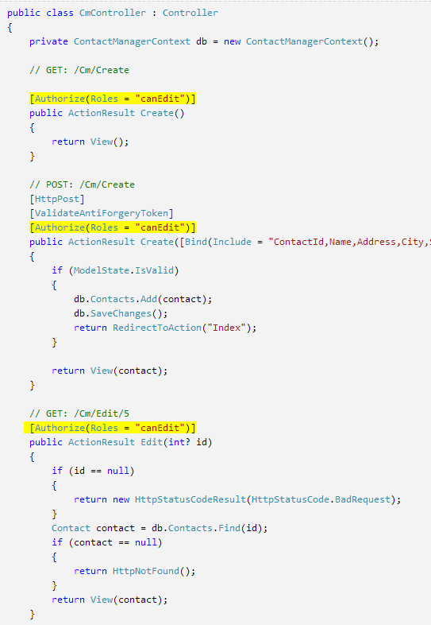
	
	_The Authorize attribute_

5. If you are still logged in from a previous session, hit the **Log out** link.
6. Click on the **About** or **Contact** links. You will be redirected to the log in page because anonymous users cannot view those pages. 
7. Click the **Register as a new user** link and add a local user with email *joe@contoso.com*. Verify *Joe* can view the Home, About and Contact pages. 

	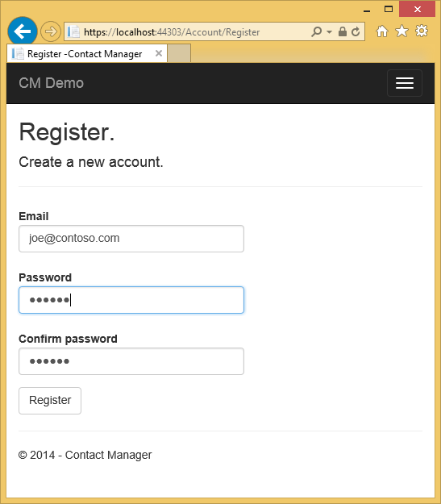
	
	_The Register page_

8. Click the *CM Demo* link and verify you see the data.

9. Click an edit link on the page, you will be redirected to the log in page (because a new local user is not added to the *canEdit* role).

10. Log in as *user1@contoso.com* with password of "P_assw0rd1" (the "0" in "word" is a zero). You will be redirected to the edit page you previously selected.

	If you can't log in with that account and password, try copying the password from the source code and pasting it. If you still can't log in, check the **UserName** column of the **AspNetUsers** table to verify *user1@contoso.com* was added. 

11. Verify you can make data changes.

<a name="Exercise11" />
##Deploying the app to Azure

1. In Visual Studio, right-click the project in **Solution Explorer** and select **Publish** from the context menu.

	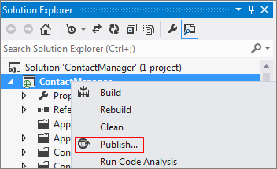
	
	_Opening the Publish Web wizard_

	The **Publish Web** wizard opens.

2. Click the **Settings** tab on the left side of the **Publish Web** dialog box. Click the **v** icon to select the **Remote connection string** for **ApplicationDbContext** and select the  **ContactManagerNN_db**.

	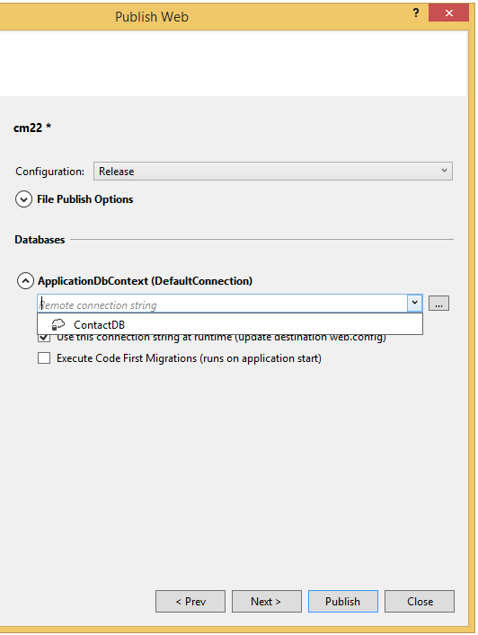
	
	_Publish Web Settings_

3. Under **ContactManagerContext**, select **Execute Code First Migrations**.

	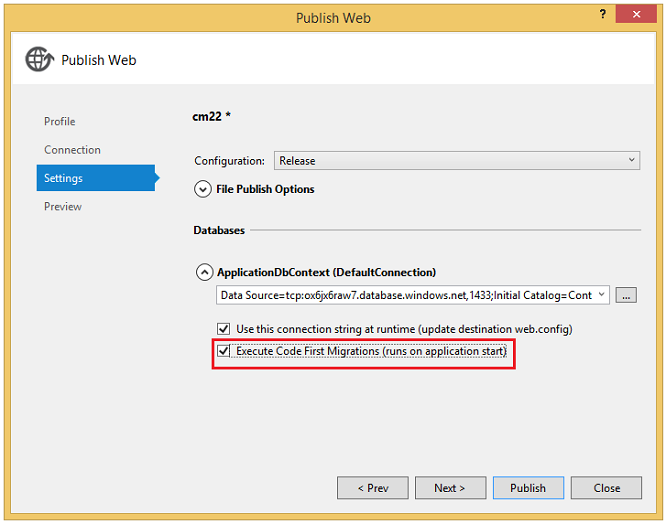
	
	_Excecuting Code-first migrations_

4. Click **Publish**.

5. Log in as *user1@contoso.com* (with password of "P_assw0rd1") and verify you can edit data.

6. Log out.

7. Go to the [Google Developers Console](https://console.developers.google.com/) and on the **Credentials** tab update the redirect URIS and JavaScript Orgins to use the Azure URL.

8. Log in using Google or Facebook. That will add the Google or Facebook account to the **canEdit** role. If you get an HTTP 400 error with the message *The redirect URI in the request: https://contactmanager{my version}.azurewebsites.net/signin-google did not match a registered redirect URI.*, you'll have to wait until the changes you made are propagated. If you get this error after more than a minute, verify the URIs are correct.

### Stop the website to prevent other people from registering  

1. In **Server Explorer**, navigate to **Websites**.
2. Right click on each Website instance and select **Stop Website**. 

	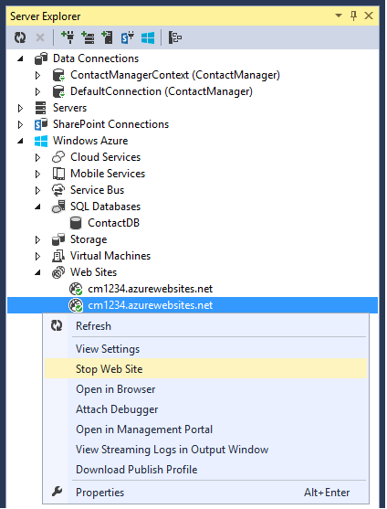
	
	_Stopping the Website_

	Alternatively, from the Azure management portal, you can select the website, then click the **stop** icon at the bottom of the page.

	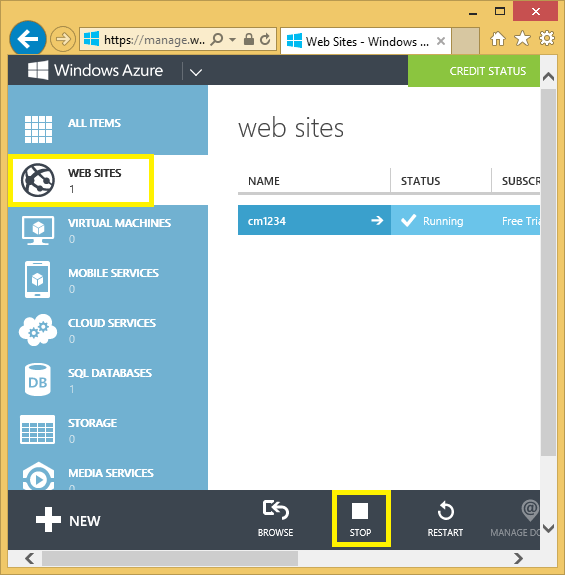
	
	_Stopping the Website from Azure_

### Remove AddToRoleAsync, Publish, and Test

1. Comment out or remove the following code from the **ExternalLoginConfirmation** method in the Account controller:

	````C#
	await UserManager.AddToRoleAsync(user.Id, "canEdit");
	````
	
2. Build the project (which saves the file changes and verify you don't have any compile errors).
3. Right-click the project in **Solution Explorer** and select **Publish**.

	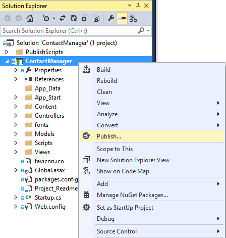
  
	_Publish in project context menu_
	
4. Click the **Start Preview** button. Only the files that need to be updated are deployed.
5. Start the website from Visual Studio or from the Portal. **You won't be able to publish while the website is stopped**.

	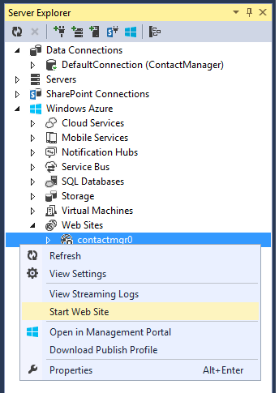
	
	_Starting the Website_

6. Go back to Visual Studio and click **Publish**.
7. Your Azure App opens up in your default browser. If you are logged in, log out so you can view the home page as an anonymous user.  
8. Click the **About** link. You'll be redirected to the Log in page.
9. Click the **Register** link on the Log in page and create local account. We will use this local account to verify you can access the read only pages but you cannot access pages that change data (which are protected by the *canEdit* role). Later on in the tutorial we will remove local account access. 

	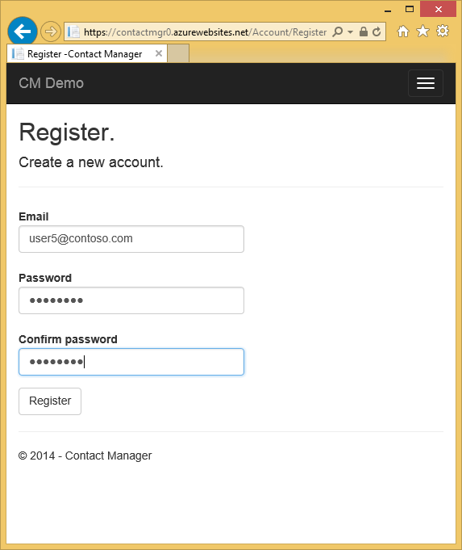
	
	_Registering an account_

10. Verify you can navigate to the *About* and *Contact* pages.

	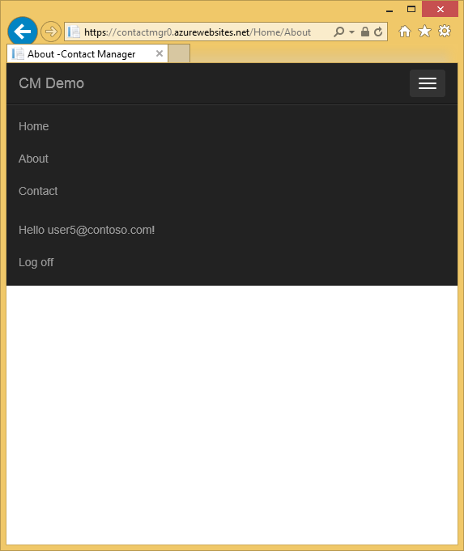
	
	_The about page_

11. Click the **CM Demo** link to navigate to the **Cm** controller. Alternatively, you can append *Cm* to the URL. 

	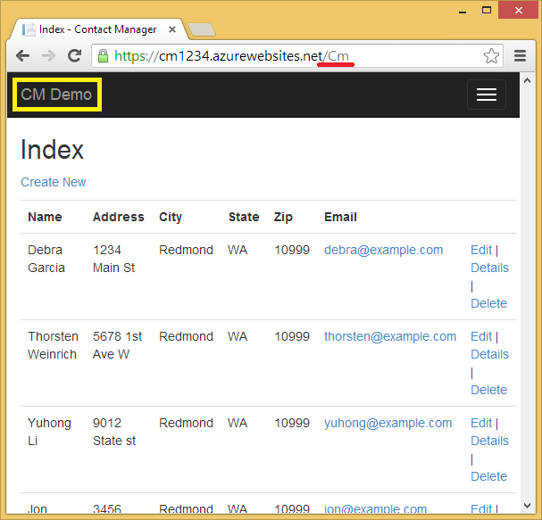
	
	_The CM page_
 
12. Click an Edit link. You will be redirected to the log in page. Under **Use another service to log in**, Click Google or Facebook and log in with the account you previously registered. (If you're working quickly and your session cookie has not timed out, you will be automatically logged in with the Google or Facebook account you previously used.)

13. Verify you can edit data while logged into that account.
 	**Note:** You cannot log out of Google from this app and log into a different google account with the same browser. If you are using one browser, you will have to navigate to Google and log out. You can log on with another account from the same third party authenticator (such as Google) by using a different browser.

> **Note:** If you have not filled out the first and last name of your Google account information, a NullReferenceException will occur.

<a name="Exercise12" />
##Examining the SQL Azure DB

1. In **Server Explorer**, navigate to the **ContactDB**.
2. Right-click **ContactDB** and select **Open in SQL Server Object Explorer**.
 
	
	
	_Opening in SQL Server Object Explorer_
 
	> **Note:** If you can't expand **SQL Databases** and *can't* see the **ContactDB** from Visual Studio, you will have to follow the instructions below to open a firewall port or a range of ports. Follow the instructions under **Set up Azure firewall rules**. You may have to wait for a few minutes to access the database after adding the firewall rule.

3. Right click on the **AspNetUsers** table and select **View Data**.

	
	
	_Viewing table data_
 
4. Note the Id from the Google account you registered with to be in the **canEdit** role, and the Id of *user1@contoso.com*. These should be the only users in the **canEdit** role. (You'll verify that in the next step.)

	
	
	_AspNetUsers table_
 
5. In **SQL Server Object Explorer**, right click on **AspNetUserRoles** and select **View Data**.

	
	
	_AspNetUserRoles table_
 
Verify the **UserId**s are from *user1@contoso.com* and the Google account you registered. 

<a name="Exercise13" />
##Setting up Azure firewall rules

Follow the steps in this section if you can't connect to SQL Azure from Visual Studio or if you get an error dialog stating "Cannot open server".


_Cannot Open Server - firewall error_

You will need to add your IP address to the allowed IPs.

1. In the Azure Portal, Select **SQL Databases** in the left tab.

	
	
	_SQL Databases in Azure Portal_

2. Click on the **ContactDB**.

3. Click the **Set up Azure firewall rules for this IP address** link.

	
	
	_Setting up firewall rules_

4. When you are prompted with "The current IP address xxx.xxx.xxx.xxx is not included in existing firewall rules. Do you want to update the firewall rules?", click **Yes**. Adding this address is often not enough behind some corporate firewalls, you will need to add a range of IP addresses.

	The next step is to add a range of allowed IP addresses.

5. In the Azure Portal, Click **SQL Databases**.
6. Select the **Servers** tab, and then click on the server you wish to configure.

	
	
	_Selecting the Server to Set up firewall rules_

7. Click the **Configure** tab.

8. Add a rule name, starting and ending IP addresses.

	
	
	_Adding the allowed IP addresses_

9. At the bottom of the page, click **Save**.
10. Please leave feedback and let me know if you needed to add a range of IP address to connect.

	Finally, you can connect to the SQL Database instance from SQL Server Object Explorer (SSOX).

11. From the View menu, click **SQL Server Object Explorer**.
12. Right click **SQL Server** and select **Add SQL Server**.
13. In the **Connect to Server** dialog box, set the **Authentication** to **SQL Server Authentication**. You will get the **Server name** and **Login** from the Azure Portal.
14. In your browser, navigate to the portal and select **SQL Databases**.
15. Select the **ContactDB**, and then click **View SQL Database connection strings**.
16. From the **Connection Strings** page, copy the **Server**  and **User ID**.
 
	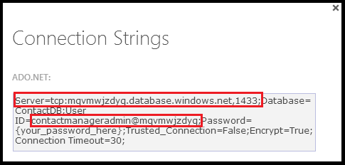
	
	_Connection String_

17. Past the **Server** and **User ID** values into the **Connect to Server** dialog in Visual Studio. The **User ID** value goes into the **Login** entry. Enter the password you used to create the SQL DB.

	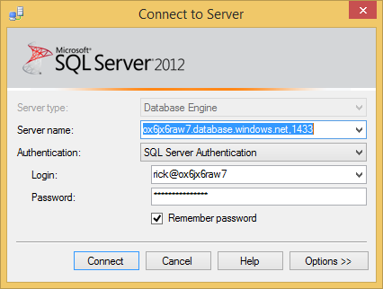
	
	_Connecting to the Database_

You can now navigate to the Contact DB using the instructions given earlier.

<a name="Exercise14" />
##To Add a User to the canEdit Role by editing database tables

Earlier in the lab you used code to add users to the **canEdit** role. An alternative method is to directly manipulate the data in the membership tables. The following steps show how to use this alternate method to add a user to a role.

2. In **SQL Server Object Explorer**, right click on **AspNetUserRoles** and select **View Data**.

	
	
	_AspNetUserRoles table_

1. Copy the *RoleId* and paste it into the empty (new) row.
	
	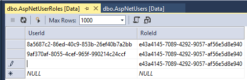
	
	_Adding a new user to the AspNetUserRoles table_
	
2. In the **AspNetUsers** table find the user you want to put in the role, and copy the  user's *Id*, and then paste it into the **UserId** column of the **AspNetUserRoles** table.

We are working on a tool that will make managing users and roles much easier.

## Summary
In this lab we walked through ...